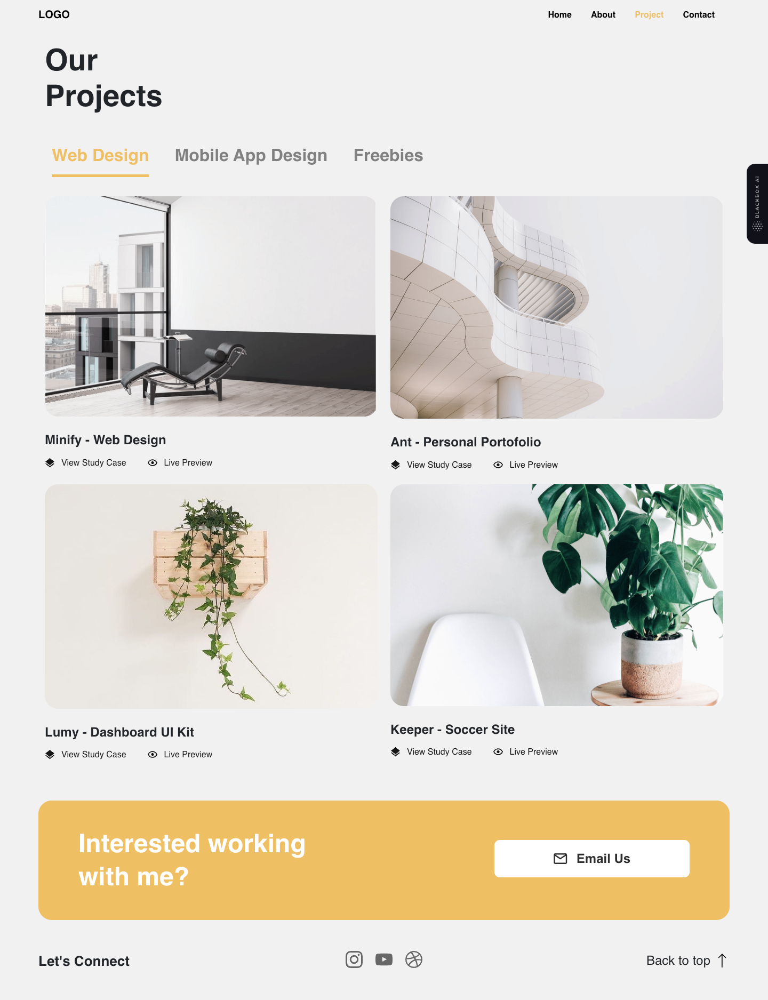

# sample-vue-page



Welcome to my project! This repository contains the source code for my first vue sample page.

## Demo Link

[https://vue-page-v01.vercel.app/](https://vue-page-v01.vercel.app/)

## Technologies Used

- Vue.js
- Bootstrap
- [Other technologies used in the project]

## Getting Started

To get started with the project, follow the instructions below:

### Prerequisites

- Node.js and npm must be installed.

### Installation

1. Clone the repository:

## Project setup

```
yarn install
```

### Compiles and hot-reloads for development

```
yarn serve
```

### Compiles and minifies for production

```
yarn build
```

### Lints and fixes files

```
yarn lint
```

### Customize configuration

See [Configuration Reference](https://cli.vuejs.org/config/).
